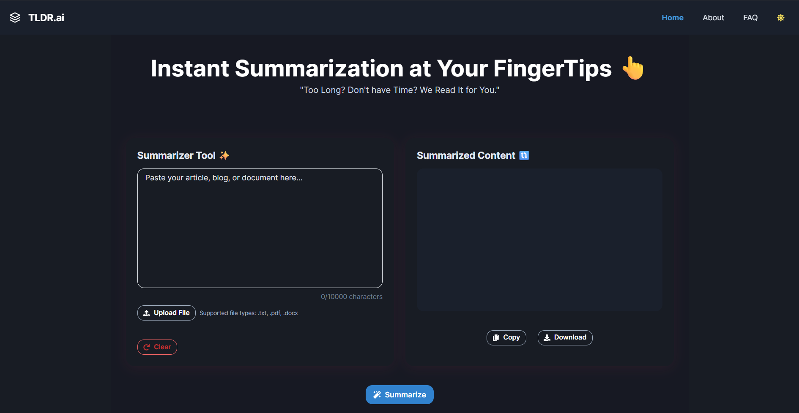

# TLDR.ai – AI Powered Text Summarizer ✨

A modern AI-powered text summarization tool that effortlessly condenses articles, blogs, research papers, and documents into clear, easy-to-read summaries.

---
### 📖 **Overview**
`TLDR.ai` is a modern web application that automatically summarizes long-form text content into concise, readable summaries. The application allows users to input text directly or upload documents in various formats (TXT, PDF, DOCX). It leverages the DeepSeek-R1-Zero AI model through the OpenRouter API to generate high-quality summaries efficiently.

The application name `"TLDR" stands for "Too Long; Didn't Read"` - a common internet acronym that perfectly captures the application's purpose of condensing lengthy content into digestible summaries.

---
To see a Demo Video: [Click here!](https://drive.google.com/file/d/14E3znpa1STYyNmBrkbtDQXv5_tWpiBfU/view?usp=drive_link)

 

You can check out the deployed app here: [TLDR.ai](https://text-summarizer-seven-ecru.vercel.app/)

---
### 💡 **Features**

- **AI Summarization:** Get concise summaries of any text using advanced AI models via the OpenRouter API (DeepSeek-R1-Zero).
- **File Upload:** Supports `.txt`, `.pdf`, and `.docx` files. Extracts and summarizes content from your documents.
- **Character Counter:** Live character count with a 10,000 character limit.
- **Copy & Download:** Copy the summary to clipboard or download as a `.txt` file.
- **Dark/Light Mode:** Toggle between beautiful dark and light themes.
- **Responsive Design:** Works seamlessly on desktop, tablet, and mobile.
- **FAQ & About Pages:** Learn more about the app and get answers to common questions.

---

### 📦 **Tech Stack**

- **Frontend:** [React](https://react.dev/) (with [Vite](https://vitejs.dev/))
- **UI:** [Chakra UI](https://chakra-ui.com/) & [React Icons](https://react-icons.github.io/react-icons/)
- **Routing:** [react-router-dom](https://reactrouter.com/)
- **PDF/DOCX Parsing:** [pdfjs-dist](https://github.com/mozilla/pdf.js/), [mammoth](https://github.com/mwilliamson/mammoth.js)
- **API:** [OpenRouter API](https://openrouter.ai/) (DeepSeek-R1-Zero model)


---

### 🚀 **Getting Started**

#### 1. **Clone the repository**

```bash
git clone https://github.com/yourusername/text-summarizer.git
cd text-summarizer
```

#### 2. **Install dependencies**

```bash
npm install
```

#### 3. **Set up environment variables**

Create a `.env` file in the root directory and add your OpenRouter API key:

```
VITE_OPENROUTER_API_KEY=your_openrouter_api_key
```


#### 4. **Run the development server**

```bash
npm run dev
```

Open [http://localhost:5173](http://localhost:5173) in your browser.

---

### 🗂️ **Project Structure**

```
src/
  [App.jsx] -> Main app with routing, layout, and pages
  [main.jsx] -> Entry point, Chakra UI, router setup
  [index.css] -> Custom styles components

src/components/ 
    [Logo.jsx] -> SVG logo component
    [Loader.jsx] -> Loader/spinner for async actions
    [TextSummarizer.jsx] -> Summarizer component
```
---
### 🤝 **Feedback and Contribution** 

It is publicly open for any contribution. Bugfixes, new features, and extra modules are welcome.

- To contribute to code: Fork the repo, push your changes to your fork, and submit a pull request.
- To report a bug: If something does not work, please report it using [GitHub Issues](https://github.com/aman-chhetri/TLDR.ai/issues).

---
### 📬 **Connect**

- Email: chhetryaman3@gmail.com
- Twitter: [@iamamanchhetri](https://twitter.com/iamamanchhetri) 
- Website: [Portfolio](https://amankshetri.com.np)
- LinkedIn: [@amankshetri](https://linkedin.com/in/amankshetri)

<div align="center">© 2025 Aman Kshetri 👨‍💻</div>
